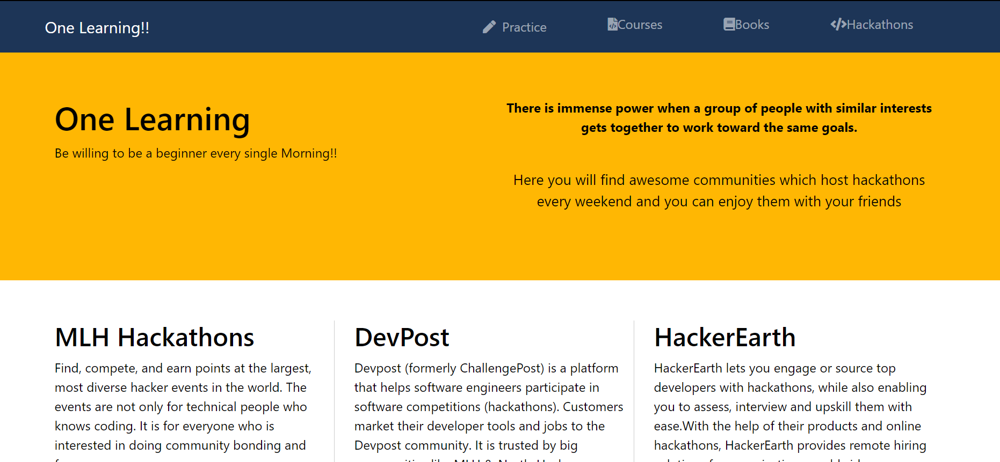

[]

<h1 align="center"> One Learning  </h1> <br>

<p align="center">
  <a href="http://onelearning.study/">
    
  </a>
</p>

<a href="https://drive.google.com/file/d/1utSbFvYENHTuZrGCbm2yjAQL65SiN5y-/view?usp=sharing"><h3 align="center">Video Demo of the website in action</h4></a>

**One Learning** has been built for [MLH Hacky-Birthday](https://organize.mlh.io/participants/events/7142-hacky-birthday-mlh) with the aim for helping the hacker community.

* This website is built using *BootStrap* , *HTML* & *Jquery*. 

* The website is published on the domain we got from *Go-Daddy Registry*.

## Table of Contents 

- [Introduction](#introduction)
- [Features](#features)
- [Contributors](#contributors)
- [Build Process](#build-process)

## Introduction

We have made this website with the help of BootStrap and Jquery . The aim of this website is to build a learning point for Hackers who want to start or make themselver better in the world of tech and programing

**Available for both Smartphones and Desktops.**

## Screenshots
<details>
  <summary>Click to expand</summary>
    
    
 Welcome Page         | Book Shelf     |  
:-------------------------:|:-------------------------:|
||
    
Footer          | Upcoming Events   |  Responsive Page |
:-------------------------:|:-------------------------:|:-------------------------:|
||

</details>

## Features

A few of the things you can do with One-Learning:

* Learn Basic Programming for particpating & competing in hackathons including programming
* Get ready for Competitive programming and Interviews
* Learn from the top courses available online 
* Get the access to top language based books
* You can also get to know about latest hackathons & open communities events

# Tech Stack

Our tech stack consists of the following:

* **BootStrap** 
* **Jquery**
* **HTML,CSS**


## Build Process

* **Clone** the project:

```
git clone https://github.com/Vishesht27/One-Learning.git
```

    
